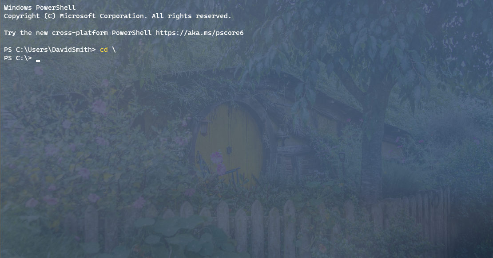
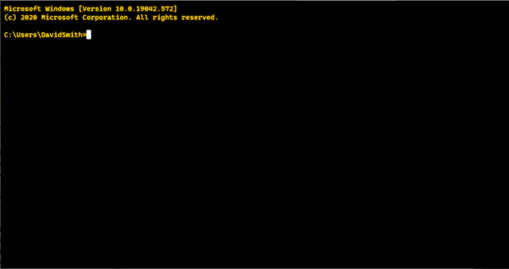
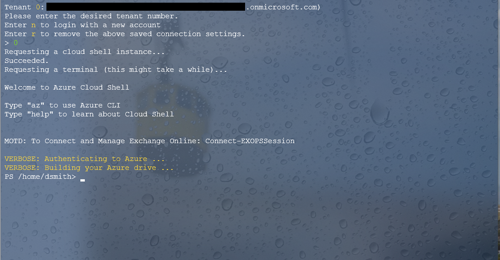

## WindowsTerminalSettings

This repo contains a copy of my settings.json file for my Windows Terminal.

It contains the following profiles:
* Windows PowerShell

* Command Prompt

* Ubuntu-18.04 (for WSL/WSL2)

* Azure Cloud Shell

I've also included copies of the images I'm using for the background.  

# To use this as YOUR settings file:
1. Clone this repo down to your computer.
2. Copy the settings.json file and the jpg files to the following directory (changing USERNAME to match yours):
    >%LOCALAPPDATA%\Microsoft.WindowsTerminal_8wekyb3d8bbwe\LocalState
3. Launch Terminal
